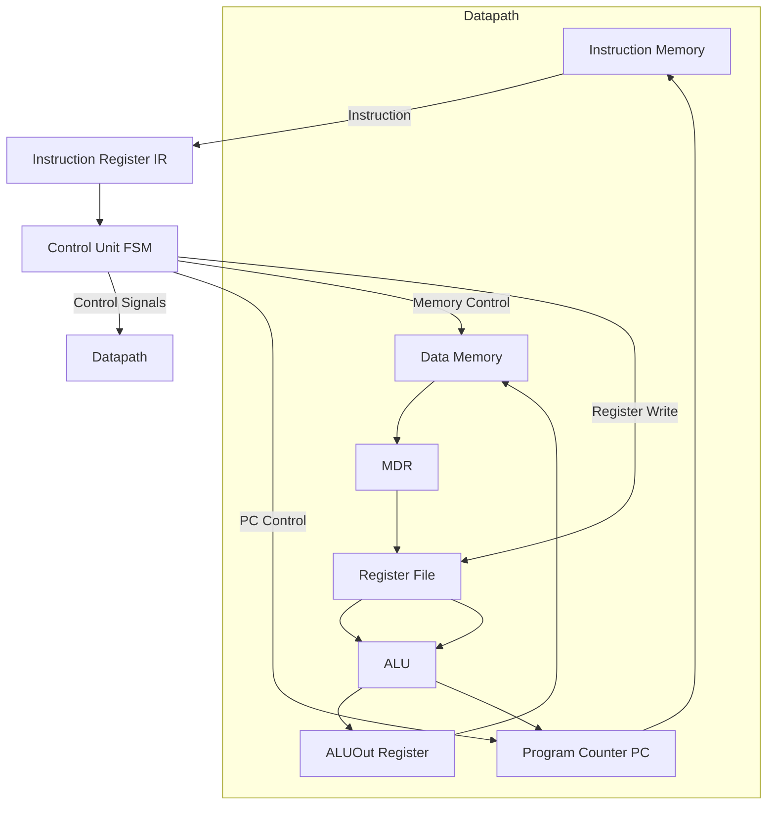

# 32-bit Multicycle RISC Processor

A 32-bit multicycle RISC processor implemented in Verilog HDL.
This project demonstrates a complete CPU design including datapath architecture, FSM-based control unit, instruction execution, and full simulation verification.

---

## System Architecture



---

## System Description

The processor is designed using a multicycle architecture, where each instruction is executed across multiple clock cycles instead of a single cycle or pipeline structure. This approach simplifies control logic and allows efficient reuse of hardware components.

The system is divided into three main parts: instruction flow, datapath, and control unit.

---

### Instruction Flow

Instructions are fetched from the instruction memory using the Program Counter (PC) and stored in the Instruction Register (IR). The control unit decodes the instruction and generates the required control signals to guide execution.

---

### Datapath Components

The datapath is responsible for executing instructions and transferring data between components.

* Register File: stores 16 general-purpose registers (R0–R15)
* ALU: performs arithmetic and logical operations
* ALUOut Register: stores intermediate results
* Data Memory: used for load and store instructions
* MDR: buffers data read from memory
* Multiplexers: control data routing
* Program Counter: tracks the current instruction address

---

### Control Unit

The control unit is implemented as a finite state machine (FSM). It controls instruction execution by generating control signals for each stage.

Each instruction follows these stages:

```text
Fetch → Decode → Execute → Memory → Write Back
```

---

## Supported Instructions

### Arithmetic and Logic

* ADD
* SUB
* CMP
* OR
* ADDI
* ORI

### Memory Operations

* LW
* SW
* LDW
* SDW

### Control Flow

* BZ
* BGZ
* BLZ
* J
* JR
* CALL

---

## Project Structure

```text
src/
  alu.v
  control.v
  cpu.v
  datapath.v
  instr_mem.v
  data_mem.v
  RegFile.v

test/
  cpu_tb.v

data/
  data.hex
  program.dat

docs/
  ReportArch.pdf
  tableGuid.pdf
```

---

## How to Run

1. Open the project in a Verilog simulator (ModelSim or Vivado)
2. Compile all source files
3. Run the testbench:

```text
cpu_tb.v
```

4. Load instructions from:

```text
program.dat
```

5. Observe waveform results

---

## Testing and Verification

The processor was tested using multiple test programs including:

* arithmetic operations
* memory access instructions
* control flow instructions

Simulation results verified correct execution of all instructions and proper data flow across the system.

---

## Key Design Decisions

* multicycle architecture used instead of pipelining to simplify control logic
* FSM used for instruction sequencing
* ALU reused across multiple stages
* internal registers (A, B, ALUOut) added to prevent data corruption
* two-cycle branch evaluation used to ensure stable execution

---

## What I Learned

* designing a processor using Verilog HDL
* building datapath and control unit
* implementing FSM-based architectures
* handling instruction execution stages
* debugging using waveform simulation
* understanding memory interaction and control flow

---

## Author

Lana Ayed Sayes
Computer Engineering Student – Birzeit University
